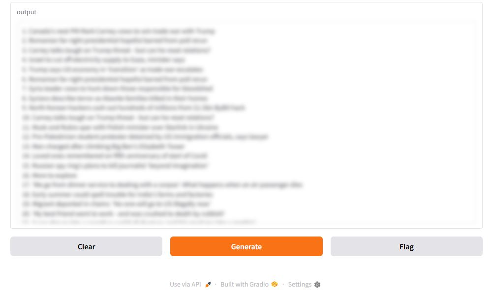

# 📰🌐 News Scraper with Web Interface
- [النسخة العربية](AR-README.md)
  
This is a Python project that scrapes headlines from a news website (e.g., BBC News) and displays them in a simple local web interface using Gradio. You can also refresh the news headlines by clicking a button.


## ✨ Features:
- 🌍 Scrapes headlines from a news website.
- 🗓️⏰ Saves the headlines to a text file named with the current date and time.
- 💻🌐 Displays the headlines on a local webpage.
- 🔄 Provides a button to refresh the headlines.


## 📋 Requirements:
- 🐍 Python 3.6 or higher
- 🌐 `requests` library
- 🧑‍💻 `beautifulsoup4` library
- 🖥️ `gradio` library


## 🛠 Installation:
1. Clone this repository :
```bash
git clone https://github.com/LaithALhaware/Web-Scraper-for-News-Websites.git
cd 'Web-Scraper-for-News-Websites'
```

2. Install the required dependencies :
```bash
pip install -r requirements.txt
```

3. Run the application :
```bash
python app.py
```

4. Open the local Gradio interface in your browser to view and refresh the news. 🌐🔄


## 👍 Example output from the code goes here :



## 📝 License
[[License](LICENSE)] ⚖️


## ❤️ Support This Project
If you find this project useful, consider supporting its development:

💰 Via PayPal: [[PayPal Link](https://www.paypal.com/ncp/payment/KC9EETJDVZQHG)]

Your support helps keep this project alive! 🚀🔥
